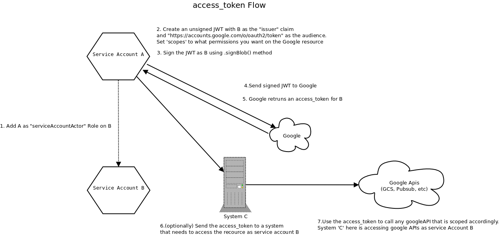
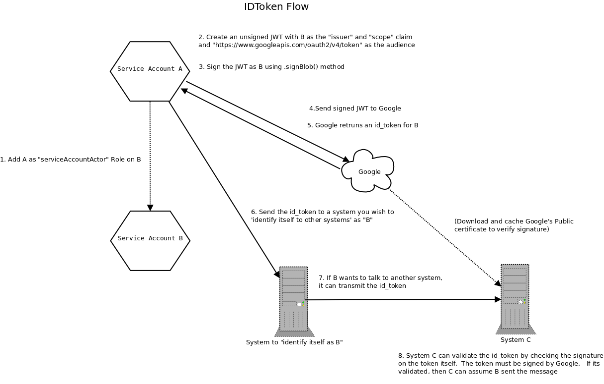

# Using serviceAccountActor IAM role for account impersonation on Google Cloud Platform

The [serviceAccountActor](https://cloud.google.com/iam/docs/service-accounts#service_accounts_as_a_resource) IAM role on Google Cloud has some very useful and powerful capabilities.  It is an IAM role that allows you to grant another user or serviceAccount the ability to impersonate a service Account.  In this way, you can have service account A impersonate B and acquire the access_tokens or id_tokens for B.

This article covers how you can acquire id and access tokens for service account B __by__ service account A.  You can also have a end-user assigned the serviceAccountActor role too.
For clarity, I've separated out the id and access token steps below.

Note: 
* access_tokens are used to gain access to a Google API __as__ B.
* id_tokens are used to identify the the service Account B to some other system.  The ID token contains digitally signed information that can be validated to assert who the token was issued to.

For more information see 
* [Acting as a service account](https://cloud.google.com/iam/docs/understanding-service-accounts#acting_as_a_service_account)
* [RFC 7519](https://tools.ietf.org/html/rfc7519)
* [JSON Web Debugger](https://jwt.io/introduction/)
* [Raw JWT implementations](https://github.com/salrashid123/jwt-samples)

> You can find the script referenced here on my [github page](https://github.com/salrashid123/gcpsamples/blob/master/auth/tokens/gcs_auth.py)

## Assign serviceAccountActor role
The first step is to assign the serviceAccountActor role **on** B **to** A.  That is, you are allowing A the permission to act as B.  This configuration is done on the
IAM Permissions page by selecting B as shown below.


In the example screenshot, 
* serviceAccountA_ID is: svc-2-429@mineral-minutia-820.iam.gserviceaccount.com
* serviceAccountB_ID is: service-account-b@mineral-minutia-820.iam.gserviceaccount.com

__Note:__ serviceAccountB_ID does not even have any valid certificate keys.  This means there are no valid physical, distributed certificate key files.

> As mentioned, you do NOT have to use a service account to impersonate another one; you can easily assign the serviceAccountActor role to an end user (e.g. user@domain.com).

## Initialize an IAM client for service Account A
Since we are doing operations as service Account A, we need to create a client for access to IAM using [Application Default Credentials](https://developers.google.com/identity/protocols/application-default-credentials):

```python
import httplib2
from apiclient.discovery import build
from oauth2client.client import GoogleCredentials
scope = 'https://www.googleapis.com/auth/iam https://www.googleapis.com/auth/cloud-platform'
os.environ["GOOGLE_APPLICATION_CREDENTIALS"] = "ServiceAccountA_keyFile.json"
credentials = GoogleCredentials.get_application_default()
if credentials.create_scoped_required():
   credentials = credentials.create_scoped(scope)
http = credentials.authorize(httplib2.Http())

service = build(serviceName='iam', version= 'v1',http=http)
resource = service.projects()
```

## Create access_token

After we assigned the role, download the certificate for A (the service you will use to impersonate B).  You may also impersonate B as a user and to do that, you will
need to initialize a client as an end user.  For more information on, see [Google Cloud Authentication Samples](https://github.com/salrashid123/gcpsamples).


### Create an unsigned JWT
Now that we have an initialized, authenticated client for A, we need to generate a JWT with some specific claims.  Since we are creating an access_token request,
the JWT needs to be in the form:

```json
{
    "iss": "serviceAccountB_ID",
    "scope": "scope1 scope2",
    "aud": "https://accounts.google.com/o/oauth2/token",
    "exp":  ___expiration_time__,
    "iat":  __issue_time__
}    
```

### Sign the JWT using Service Account A credentials
Now that we have an unsigned JWT claim set, we need to sign it using A's credentials but instruct __.signBlob()__ to sign it for B:
```python
client_id= 'serviceAccountB_ID'
slist = resource.serviceAccounts().signBlob(name='projects/mineral-minutia-820/serviceAccounts/' + client_id, 
                                                  body={'bytesToSign': base64.b64encode(jwt) })
```
> Note, the public certificate for any Google Service account is public and visible
For serviceAccount B:
* JWK Format: [https://www.googleapis.com/service_accounts/v1/jwk/service-account-b@mineral-minutia-820.iam.gserviceaccount.com](https://www.googleapis.com/service_accounts/v1/jwk/service-account-b@mineral-minutia-820.iam.gserviceaccount.com)
* X509 Format: [https://www.googleapis.com/service_accounts/v1/metadata/x509/service-account-b@mineral-minutia-820.iam.gserviceaccount.com](https://www.googleapis.com/service_accounts/v1/metadata/x509/service-account-b@mineral-minutia-820.iam.gserviceaccount.com)


### Reconstruct the JWT with signed data
Now that we have the signature for the JWT, we need to append the signature to the unsigned part
```python
client_id= 'serviceAccountB_ID'
slist = resource.serviceAccounts().signBlob(name='projects/mineral-minutia-820/serviceAccounts/' + client_id, 
                                                  body={'bytesToSign': base64.b64encode(jwt) })

resp = slist.execute()     
r = base64.urlsafe_b64encode(base64.decodestring(resp['signature']))
signed_jwt = jwt + '.' + r    
```

### Trnsmit the singed JWT to Google to get an access_token
```python
url = 'https://accounts.google.com/o/oauth2/token'
data = {'grant_type' : 'assertion',
        'assertion_type' : 'http://oauth.net/grant_type/jwt/1.0/bearer',
        'assertion' : signed_jwt }
headers = {"Content-type": "application/x-www-form-urlencoded"}     
data = urllib.urlencode(data)
req = urllib2.Request(url, data, headers)
resp = urllib2.urlopen(req).read()
parsed = json.loads(resp)
access_token = parsed.get('access_token')
```

Now you have an access token.  With this, you can access any GoogleAPI that is scoped correctly and to which B has access.

One way to initialize a Google API client given a raw access_token is to use [oauth2client.client.AccessTokenCredentials]()http://oauth2client.readthedocs.io/en/latest/source/oauth2client.client.html#oauth2client.client.AccessTokenCredentials.
Other languages have similar bindings. 

You can also verify the access_token by interrogating the __tokeninfo__ endpoint as shown here:
```
curl https://www.googleapis.com/oauth2/v3/tokeninfo?access_token=ya29.ElnUAws0MfV3om_tqQ0ZS3g7-BZ2ZS_uaJUNdPk8TI7hHkPnFb8Kesg67WQwJswTfD1nYTk-tD0MDUf6X3-pKklpicBDZszq16Q7smBZoDemnYcWaYvJ8gjqnw

{
 "azp": "104943293997971332223",
 "aud": "104943293997971332223",
 "scope": "https://www.googleapis.com/auth/userinfo.email",
 "exp": "1484452560",
 "expires_in": "3543",
 "email": "service-account-b@mineral-minutia-820.iam.gserviceaccount.com",
 "email_verified": "true",
 "access_type": "offline"
}
```



### access_token Revocation
By default, access_tokens are valid for 1hour from the time they are issued.  You can revoke them prior to that by invoking the oauth2 revocaiton endpoint:
```
curl https://accounts.google.com/o/oauth2/revoke?token={token}
```
* [Token Revocation](https://developers.google.com/identity/protocols/OAuth2#serviceaccount)

## id_token Generation

Though id_tokens and access_tokens have similar flows, they are used for very different things:  as the name implies, access_tokens are used to grant access
to google resources (eg. GCS, PubSub, etc) while id_tokens simply assert the bearers identity.

id_tokens are digitally signed by google so if I give you an id_token, you can verify its authenticity by verifying its signature against Google's public certificate.
The id_tokens are simply convey who the caller is (not what it can do).  

If you need two system to communicate securely, you can pass (via SSL), an id_token.  The recieving system can localy validate the token using a cached copy of Google's certificate.

See:
* [id_tokens](https://developers.google.com/identity/sign-in/web/backend-auth)




### Create an unsigned JWT
The first step is to create an unsigned JWT but have the scope to the service Account B's ID:
```json
{
    "iss": "serviceAccountB_ID",
    "scope": "serviceAccountB_ID",
    "aud": "https://www.googleapis.com/oauth2/v4/token",
    "exp":  "___expiration_time__",
    "iat": "__issue_time__"
}
```
Note the audience is different than for an access_token.

### Sign the JWT using Service Account A credentials
Now that we have an unsigned JWT claim set, we need to sign it using A's credentials but instruct __.signBlob()__ to sign it for B:
```python
client_id= 'serviceAccountB_ID'
slist = resource.serviceAccounts().signBlob(name='projects/mineral-minutia-820/serviceAccounts/' + client_id, 
                                                  body={'bytesToSign': base64.b64encode(jwt) })
```

### Reconstruct the JWT with signed data
Now that we have the signature for the JWT, we need to append the signature to the unsigned part
```python
 slist = resource.serviceAccounts().signBlob(name='projects/mineral-minutia-820/serviceAccounts/' + client_id, 
                                             body={'bytesToSign': base64.b64encode(jwt) })
resp = slist.execute()     
r = base64.urlsafe_b64encode(base64.decodestring(resp['signature']))
signed_jwt = jwt + '.' + r    
```


### Trnsmit the singed JWT to Google to get an access_token
```python
url = 'https://www.googleapis.com/oauth2/v4/token'
data = {'grant_type' : 'urn:ietf:params:oauth:grant-type:jwt-bearer',
        'assertion' : signed_jwt }
headers = {"Content-type": "application/x-www-form-urlencoded"}
     
data = urllib.urlencode(data)
req = urllib2.Request(url, data, headers)
resp = urllib2.urlopen(req).read()
parsed = json.loads(resp)
id_token = parsed.get('id_token')
```
 
Now that we have the id_token, we can transmit it to another system.

### id_token validation

The recieving system that gets the id_token **must** validate its authenticity.

* [Validating ID tokens](https://developers.google.com/identity/protocols/OpenIDConnect#validatinganidtoken)
* [Oauth2 Validation](https://developers.google.com/identity/protocols/OAuth2UserAgent#tokeninfo-validation)

You can validate it using some standard libraries too:

```python
from oauth2client.client import verify_id_token
from oauth2client.crypt import AppIdentityError
try:
  jwt = verify_id_token(id_token, client_id)     
  self.log('\n ID_TOKEN Validation: \n ' + json.dumps(jwt,sort_keys = False, indent = 4)  +' \n', logging.INFO)
except AppIdentityError, e:
  self.log('Payload: ' + str(e.read), logging.ERROR) 
```

The public certificate used by Google to sign can be found at:
* [https://www.googleapis.com/oauth2/v1/certs](https://www.googleapis.com/oauth2/v1/certs)

## access_token/id_token script
You can find the script refreenced here on my [github page](https://github.com/salrashid123/gcpsamples/blob/master/auth/tokens/gcs_auth.py).  To use it, you need to download a certificate for service Account A, assign the serviceAccountActor role to it
for B, then install the libraries and invoke it with service account B's ID value

```bash
virtualenv env 
source env/bin/activate
pip install requests google-api-python-client httplib2 oauth2client
```

```bash
python gcs_auth.py --client_id=service-account-b@mineral-minutia-820.iam.gserviceaccount.com

[2017-01-14 18:56:00.559229] access_token: ya29.ElnUAws0MfV3om_tqQ0ZS3g7-BZ2ZS_uaJUNdPk8TI7hHkPnFb8Kesg67WQwJswTfD1nYTk-
tD0MDUf6X3-pKklpicBDZszq16Q7smBZoDemnYcWaYvJ8gjqnw

[2017-01-14 18:56:01.007865] id_token: eyJhbGciOiJSUzI1NiIsImtpZCI6ImJlMmZiMmY3ZDQ5ZDQwYjEzYTNmNjM2MjE5MDkzYjcyZmUxNzc5ZTkifQ.
eyJpc3MiOiJodHRwczovL2FjY291bnRzLmdvb2dsZS5jb20iLCJpYXQiOjE0ODQ0NDg5NjAsImV4cCI6MTQ4NDQ1MjU2MCwiYXVkIjoic2VydmljZS1hY2NvdW50LWJ
AbWluZXJhbC1taW51dGlhLTgyMC5pYW0uZ3NlcnZpY2VhY2NvdW50LmNvbSIsInN1YiI6IjEwNDk0MzI5Mzk5Nzk3MTMzMjIyMyIsImVtYWlsX3ZlcmlmaWVkIjp0cn
VlLCJhenAiOiJzZXJ2aWNlLWFjY291bnQtYkBtaW5lcmFsLW1pbnV0aWEtODIwLmlhbS5nc2VydmljZWFjY291bnQuY29tIiwiZW1haWwiOiJzZXJ2aWNlLWFjY291b
nQtYkBtaW5lcmFsLW1pbnV0aWEtODIwLmlhbS5nc2VydmljZWFjY291bnQuY29tIn0.hk-9CvGqfkiF_pfMU3kUeWkBiSpCbhyxlysgMOVNyb6nbUW-Mv
X3WsylzxywI-aj5u9lv6HvdAEAHzspmai-bu5MujtXS6MHTY9_6TGZ0_2rtmNnlv8VokSA1W_OB8aIBqI58AR8a0pSLkwUX0I_vrb9GFtR13bWX516P9A3nS
SEbXS8eH6hYXKmpnaqHUhm3osqYOWpZYQx4wxX6txMKnm5HcZ9s2C16HwSV33nBFvEdE4_naKctsAac1QWzIigEr95_SJFLfHhLBCP48-IHNzEPFpp0xUZsR
aeH84BAu4eFZ3xCg4MOr0log2E1CfrMJA0ineKBWRAXID78tfQ-w

[2017-01-14 18:56:01.222985]  ID_TOKEN Validation: 
 {
    "aud": "service-account-b@mineral-minutia-820.iam.gserviceaccount.com", 
    "iss": "https://accounts.google.com", 
    "email_verified": true, 
    "exp": 1484452560, 
    "azp": "service-account-b@mineral-minutia-820.iam.gserviceaccount.com", 
    "iat": 1484448960, 
    "email": "service-account-b@mineral-minutia-820.iam.gserviceaccount.com", 
    "sub": "104943293997971332223"
} 

```