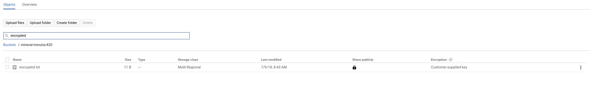

# GCS Signed URL with Customer Supplied Encryption Key

Sample java app that uses [google-cloud-java](https://github.com/GoogleCloudPlatform/google-cloud-java) libraries to generate a GCS [Signed URL](https://cloud.google.com/storage/docs/access-control/signed-urls) with [Customer Supplied Encryption Keys](https://cloud.google.com/storage/docs/encryption/using-customer-supplied-keys) (CSEK).

A service account can generate a SigneURL and hand it to a user to perform an authorized upload/download.  THe file that is stored in GCS by default using that will be using a Google Managed Encryption Key.   GCS also allows a user to specify their own encryption key on the object.  The only way to create or access that CSEK enabled object is if the key is supplied along with the request...google cannot access that object in anyway.

Both Singed URL and CSEK are usually used independently.  This snippet covers a relatively uncommon usecase case:  issuing a signedURL with a CSEK.  THe flow is somewhat awkward:  when you generate the signedURL, you first indicate that encryption will be used by specifying a header value in addition to the other custom headers.  Then provide the signedURL to the enduser who uses the URL to get/put an object.  The user *must* transmit the csek headers with their encryption key AND andy custom headers specified at the time the request was originally signed.


In the following snippet, we're specifying the headers the signedURL will include in the signatuere:
```java
BlobInfo BLOB_INFO1 = BlobInfo.newBuilder(BUCKET_NAME, BLOB_NAME).build();

Map<String, String> extHeaders = new HashMap<String, String>();
	extHeaders.put("x-goog-encryption-algorithm", "AES256");
	extHeaders.put("x-goog-meta-icecreamflavor", "vanilla");
URL url =
	storage_service.signUrl(
			BLOB_INFO1,
			60,
			TimeUnit.SECONDS,
			Storage.SignUrlOption.httpMethod(HttpMethod.PUT),
			Storage.SignUrlOption.withExtHeaders(extHeaders));
```

-
- ```x-goog-meta-icecreamflavor```  is a custom/user-defined header value
- ```x-goog-encryption-algorithm:AES256```  indicates csek will be used

What we are not specifying are the encryption key values:

 ```
x-goog-encryption-key:
x-goog-encryption-key-sha256:
 ```

The output of the first step will geneatre a signedURL.  Provide this URL to an end user


THe enduser will use the signedURL to upload/download the object but also add on the ```b64encoded``` form of their encryption key and hash of that key in the header:


First generate they key, keyhash:
```java
KeyGenerator keyGen = KeyGenerator.getInstance("AES");
keyGen.init(256);
SecretKey skey = keyGen.generateKey();
String encryption_key = Base64.getEncoder().encodeToString(skey.getEncoded());

MessageDigest digest = MessageDigest.getInstance("SHA-256");
String encryption_key_sha256 = Base64.getEncoder().encodeToString(digest.digest(skey.getEncoded()));
```

then use that to transmit the payload using the signedURL provided:

```java
String postData = "lorem ipsum";

HttpsURLConnection httpCon = (HttpsURLConnection) url.openConnection();
httpCon.setDoOutput(true);
httpCon.setRequestMethod("PUT");
httpCon.setRequestProperty("x-goog-encryption-algorithm", "AES256");
httpCon.setRequestProperty("x-goog-encryption-key", encryption_key);
httpCon.setRequestProperty("x-goog-encryption-key-sha256", encryption_key_sha256);
httpCon.setRequestProperty("x-goog-meta-icecreamflavor", "vanilla");
httpCon.setRequestProperty("Content-Length", "" + postData.getBytes().length);

OutputStreamWriter out = new OutputStreamWriter(httpCon.getOutputStream());
out.write(postData);
out.close();
httpCon.getInputStream();
```


In the end, you should see the objet you just created in GCS with the specific flag that its encrypted as well as metadata for your custom header:


```
$ gsutil stat gs://mineral-minutia-820/encrypted.txt
gs://mineral-minutia-820/encrypted.txt:
    Creation time:          Mon, 09 Jul 2018 15:43:29 GMT
    Update time:            Mon, 09 Jul 2018 15:43:29 GMT
    Storage class:          STANDARD
    Content-Length:         11
    Content-Type:           None
    Metadata:               
        icecreamflavor:     vanilla
    Hash (crc32c):          encrypted
    Hash (md5):             encrypted
    Encryption algorithm:   AES256
    Encryption key SHA256:  v8ABZtwHgDNG6OS42DZNkJcSfk62V2um4NQq9FtVN8o=
    ETag:                   CI60//+tktwCEAE=
    Generation:             1531151009176078
    Metageneration:         1
```



Here are some links for constructing signedURL headers:

- [GCS Canonical Extension Headers](https://cloud.google.com/storage/docs/access-control/signed-urls#about-canonical-extension-headers)
- [GCS Customer Supplied Encryption Keys](https://cloud.google.com/storage/docs/encryption/using-customer-supplied-keys)

---

## References

- [CustomerSuppliedEncryptionKeysSample.java](https://github.com/GoogleCloudPlatform/java-docs-samples/blob/master/storage/json-api/src/main/java/CustomerSuppliedEncryptionKeysSamples.java#L40)

- Generate key, keyhash manually:

```
  python -c 'import base64; import os; print(base64.encodestring(os.urandom(32)))'
  Tsw3RFJyxkQmnlq8vM25jkgZWE5OoHDI5kLKr67S6i8=

  openssl base64 -d <<< Tsw3RFJyxkQmnlq8vM25jkgZWE5OoHDI5kLKr67S6i8= | openssl dgst -sha256 -binary | openssl base64
  WsFuURsydzY2WBItGv2P2HTfNDvEgV262XyTUanRqYY=
```

- CESK+SignedURL with curl

```
curl -v \
    -H "x-goog-encryption-algorithm:AES256" \
    -H "x-goog-encryption-key:Tsw3RFJyxkQmnlq8vM25jkgZWE5OoHDI5kLKr67S6i8=" \
    -H "x-goog-encryption-key-sha256:WsFuURsydzY2WBItGv2P2HTfNDvEgV262XyTUanRqYY=" \
    -H "x-goog-meta-icecreamflavor:vanilla" \
    -X PUT "https://storage.googleapis.com/mineral-minutia-820/encrypted.txt?GoogleAccessId=svc-2-429@mineral-minutia-820.iam.gserviceaccount.com&Expires=1532323673&Signature=xSwnQR21YoIW64ZZw998Q1UZbYGW8FWEpNqpT2UeIDRA4thQq3erpfn%2FvhIaVCzgUeXd0eTH7dz85GJ40FPlxh%2Fx9KXBE1rx2riPG8Cmel9CeW0P4TrUgZ21%2BozfSPCQ%2BwZNPVOrGg%2FAYvLO5IR9esDKsIiQquNrru1TnDJTsREcIEgjxLi4zEuejd%2FaWSIIMGb%2BKimAmWvzt8Bvtk4bsKQRWfvvBerttr2bpXt624VbRGHsuT2JOQqlzM%2F7JwnTJOb42Bb6UQ8GMxvt41Ow2jYA9gTnqgeR5OKuHaaIiNTZM2StnmSfdweJTtupZ19LycTafdpkbw%2BxWq9ablahblah"  \
    --upload-file encrypted.txt

> PUT /mineral-minutia-820/encrypted.txt?GoogleAccessId=svc-2-429@mineral-minutia-820.iam.gserviceaccount.com&Expires=1532323673&Signature=xSwnQR21YoIW64ZZw998Q1UZbYGW8FWEpNqpT2UeIDRA4thQq3erpfn%2FvhIaVCzgUeXd0eTH7dz85GJ40FPlxh%2Fx9KXBE1rx2riPG8Cmel9CeW0P4TrUgZ21%2BozfSPCQ%2BwZNPVOrGg%2FAYvLO5IR9esDKsIiQquNrru1TnDJTsREcIEgjxLi4zEuejd%2FaWSIIMGb%2BKimAmWvzt8Bvtk4bsKQRWfvvBerttr2bpXt624VbRGHsuT2JOQqlzM%2F7JwnTJOb42Bb6UQ8GMxvt41Ow2jYA9gTnqgeR5OKuHaaIiNTZM2StnmSfdweJTtupZ19LycTafdpkbw%2Bblahblah HTTP/2
> Host: storage.googleapis.com
> User-Agent: curl/7.60.0
> Accept: */*
> x-goog-encryption-algorithm:AES256
> x-goog-encryption-key:Tsw3RFJyxkQmnlq8vM25jkgZWE5OoHDI5kLKr67S6i8=
> x-goog-encryption-key-sha256:WsFuURsydzY2WBItGv2P2HTfNDvEgV262XyTUanRqYY=
> x-goog-meta-icecreamflavor:vanilla
> Content-Length: 8
>

< HTTP/2 200
< x-guploader-uploadid: AEnB2Ur-cd5eccmHZ0YLGL0ivysV7C1AOQfHyuGEYgOtLO_E3JEnAZmmxCyrvwIvcYVp6-rYkLY1JyFTyg6HLsPjjTQUcmSX6w
< etag: "-CNrxx8KkkdwCEAE="
< x-goog-generation: 1531114104682714
< x-goog-metageneration: 1
< x-goog-hash: crc32c=FlsfVQ==
< x-goog-hash: md5=HQNwvQlxFPyedRwG5Op+9A==
< x-goog-stored-content-length: 8
< x-goog-stored-content-encoding: identity
< x-goog-encryption-algorithm: AES256
< x-goog-encryption-key-sha256: WsFuURsydzY2WBItGv2P2HTfNDvEgV262XyTUanRqYY=
< vary: Origin
< content-length: 0
< date: Mon, 09 Jul 2018 05:28:24 GMT
< server: UploadServer
< content-type: text/html; charset=UTF-8
< alt-svc: quic=":443"; ma=2592000; v="43,42,41,39,35"
```


- GCS AccessLogs for SignedURL + CSEK

If you enable [GCS Access Logs](https://cloud.google.com/storage/docs/access-logs), an entry for a signedURL would look like the following.  Note, the custom  encryption headers are NOT provided (the latter is intentional)
```
"time_micros","c_ip","c_ip_type","c_ip_region","cs_method","cs_uri","sc_status","cs_bytes","sc_bytes","time_taken_micros","cs_host","cs_referer","cs_user_agent","s_request_id","cs_operation","cs_bucket","cs_object"

"1531116650186616","73.162.112.208","1","","PUT","/mineral-minutia-820/encrypted.txt?GoogleAccessId=svc-2-429@mineral-minutia-820.iam.gserviceaccount.com&Expires=1532326249&Signature=xSwnQR21YoIW64ZZw998Q1UZbYGW8FWEpNqpT2UeIDRA4thQq3erpfn%2FvhIaVCzgUeXd0eTH7dz85GJ40FPlxh%2Fx9KXBE1rx2riPG8Cmel9CeW0P4TrUgZ21%2BozfSPCQ%2BwZNPVOrGg%2FAYvLO5IR9esDKsIiQquNrru1TnDJTsREcIEgjxLi4zEuejd%2FaWSIIMGb%2BKimAmWvzt8Bvtk4bsKQRWfvvBerttr2bpXt624VbRGHsuT2JOQqlzM%2F7JwnTJOb42Bb6UQ8GMxvt41Ow2jYA9gTnqgeR5OKuHaaIiNTZM2StnmSfdweJTtupZ19LycTafdpkbw%2Bblahblah","200","11","0","260000","storage.googleapis.com","","Java/1.8.0_171,gzip(gfe)","AEnB2Ur-cd5eccmHZ0YLGL0ivysV7C1AOQfHyuGEYgOtLO_E3JEnAZmmxCyrvwIvcYVp6-rYkLY1JyFTyg6HLsPjjTQUcmSX6w","PUT_Object","mineral-minutia-820","encrypted.txt"
```
