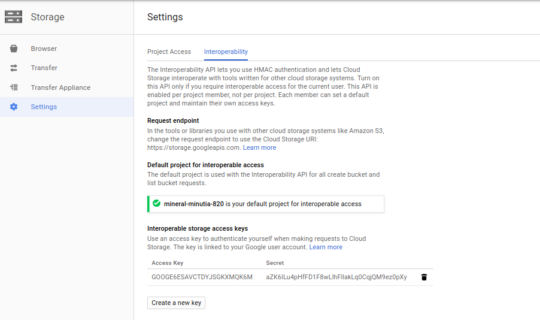

# GCS HMAC SignedURL

Sample for HMAC SignedURL for Google Cloud Storage

"Note: Signing with the RSA algorithm is supported for the Cloud Storage XML API, but not the JSON API. You can also sign URLs using HMAC when using the XML API for interoperable access."

**NOTE**: 
"The Interoperability API lets you use HMAC authentication and lets Cloud Storage interoperate with tools written for other cloud storage systems. Turn on this API only if you require interoperable access for the current user. This API is enabled per project member, not per project. Each member can set a default project and maintain their own access keys."

"Use an access key to authenticate yourself when making requests to Cloud Storage. The key is linked to your Google user account."

- [https://cloud.google.com/storage/docs/migrating?hl=en_US#keys](https://cloud.google.com/storage/docs/migrating?hl=en_US#keys)


Meaning, your HMAC key is associated with your useraccount and at the time of writing 8/3/18, service accounts are not supported.

Anyway, to use this sample, first enable iterop access and generate a key:



Substitute the key,secret into the sample (make sure you have access to the bucket/object)

```
$ python hmac_sign.py 
PUT:
https://storage.googleapis.com/your-project/somefile.txt?GoogleAccessId=GOOGE6ESAVCTDYJSGKXMQK6M&Expires=1533332885&Signature=2wEIAHhvQFeKSeUmM/X6uF2Ge%2Bk%3D
put status_code: 200
data: 
---------------------------------
GET
https://storage.googleapis.com/your-project/somefile.txt?GoogleAccessId=GOOGE6ESAVCTDYJSGKXMQK6M&Expires=1533332885&Signature=e1ySGToX41gXS%2BdwUw0x2glM4uI%3D
get status_code: 200
data; lorem ipsum
```


---

Just as a side note, you can also embed the HMAC key into a Trusted Platform Module similar to the AWS singer here

- [AWS v4 Signer for embedding Access Secrets to PKCS11 and TPMs](https://github.com/salrashid123/aws_hmac)