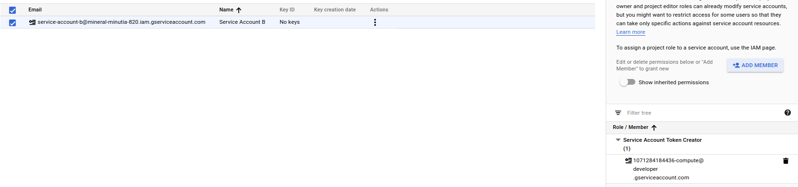

# How to SignURL on GCP without a key (locally, that is!)


[GCS SignedURLs](https://cloud.google.com/storage/docs/access-control/signed-urls) requires a service account to sign when used in RSA mode and in interop, just HMAC shared key.

As implied, using an RSA for SignedURL requires access to a private key to sign in the first place.  Normally, GCS SignedURL users download a private key file from the cloud console and have that accessible to the program to do the signing.  That standard procedure is described here:

- [Creating a SingedURL with a Program](https://cloud.google.com/storage/docs/access-control/create-signed-urls-program)


However, there is an indirect way to get access to a signers key and sign:  use [iamcredentials.signBlob()](https://cloud.google.com/iam/credentials/reference/rest/v1/projects.serviceAccounts/signBlob)


WHat that method basically allows you to do is to 'remotely sign' for a service account instead of locally with a private key. In this way, a user or another service account can sign an arbitrary blob on behalf of another service account.   This is pretty useful because it allows you to generate a SignedURL for GCS access.

This article shows one simple way to allow a Compute ENgine instance to issue a signedURL without you having to distribute a private key.  I used GCE but you can use GCS or even another service account locally 


## Setup IAM TokenCreator

The first step is to setup an IAM role such that one service account can sign on behalf of another:

In the following,  ```1071284184436-compute@developer.gserviceaccount.com``` can sign for ```service-account-b@mineral-minutia-820.iam.gserviceaccount.com```


That means, the signedURL will be owned and issued by ```service-account-b@mineral-minutia-820.iam.gserviceaccount.com```

## Create a GCS instance

Create a GCS instance with the ```iam``` scope and set the service account with access to sign on the target:

```
gcloud compute instances create instance-1 \
    --zone=us-central1-a  \
    --service-account=1071284184436-compute@developer.gserviceaccount.com   \
    --scopes=https://www.googleapis.com/auth/iam 
```


## Modify SignedURL script and upload

Now modify the sample provide and set it to use the service account to sign as well as the bucket/object you need

```
 gcloud compute scp main.py instance-1:
 gcloud compute scp requirements.txt instance-1:
```

## Install libraries on GCE instance

```
gcloud compute ssh instance-1

sudo apt-get update && sudo apt install python3-venv
python3 -menv venv
source venv/bin/activate
pip install -r requirements.txt
```


## Run script

Now if you invoke the script, the compute engine service account will use the IAM api and get a signature on behalf of ```service-account-b@mineral-minutia-820.iam.gserviceaccount.com```.   After that, it will use that url to upload and download a simple file

```
$ python main.py 
Generated PUT signed URL:
https://storage.googleapis.com/.....
```

If you wantto test this script locally, please use a JSON certificate file that has the same IAM  Token Creator role on the target service account or grant your 
cloud SDK user Token Creator role on the target service account.

Note, the following feature requests for the _google-cloud-python_ library could incorporate this whole flow into the library itself so you don't have to do these manual steps
  - https://github.com/GoogleCloudPlatform/google-auth-library-python/issues/50
 - https://github.com/GoogleCloudPlatform/google-auth-library-python/issues/238


### Other links/articles you maybe interested in:

- [GCS SignedURL with Customer Supplied Encryption Key](https://medium.com/google-cloud/gcs-signed-url-with-customer-supplied-encryption-key-c89740f31855)
- [GCS SignedURL Resumable Upload with curl](https://medium.com/google-cloud/gcs-signed-url-with-customer-supplied-encryption-key-c89740f31855)
- [GCS SignedURL with HMAC](../gcs_hmac_signedurl/)
- [Using serviceAccountActor IAM role for account impersonation on Google Cloud Platform](https://medium.com/google-cloud/using-serviceaccountactor-iam-role-for-account-impersonation-on-google-cloud-platform-a9e7118480ed)
