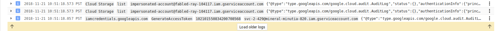
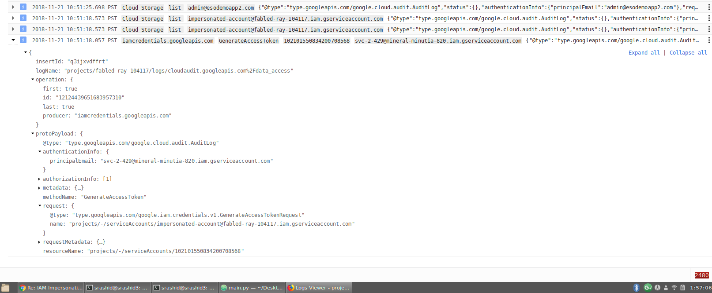
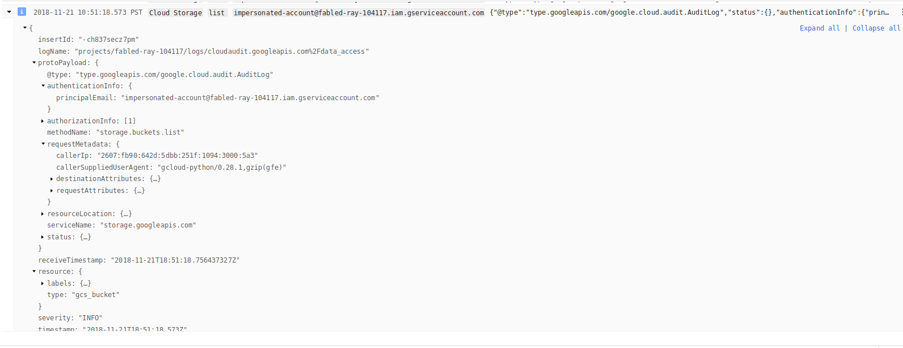

# Using ImpersonatedCredentials for Google Cloud APIs

Almost two years ago I wrote an article about using the [Service Account Actor IAM role for account impersonation](
https://medium.com/google-cloud/using-serviceaccountactor-iam-role-for-account-impersonation-on-google-cloud-platform-a9e7118480ed).  Since then, there have been some API surface changes and enchanced capabilities that makes that flow a lot easier...and as noted in the article, a bit obsolete.  The ideas contained in that article are still valid though the mechanism is dated.  In the new flow, you can now 'just get' an `access_token`, `id_token`, `jwt` or sign arbitrary blobs for a target service account by directly calling the [iamcredentials API](https://cloud.google.com/iam/credentials/reference/rest/#service-iamcredentialsgoogleapiscom). 

Lets use that API and go one step further: what if we bake in that exchange directly into the varioud `google-auth-*` libraries directly?  That is, perform the exchange directly within any cloud library and use the assumed identity within any of library service set.  For example:

1. You start with a credential A initialized by any means (Service Account JSON, GCE metadata, userflow, etc)
2. You use GCP auth libraries to exchange A for credentials representing serviceAccountB
3. You use any google-cloud* library as account B 

In code, it would look like this:


```python
#!/usr/bin/python
from google.cloud import storage
import google.auth
from google.oauth2 import credentials
from google.oauth2 import service_account

from google.auth import impersonated_credentials

# For service account credentials
svc_account_file = 'svc-src.json'
target_scopes = ['https://www.googleapis.com/auth/devstorage.read_only']
source_credentials = service_account.Credentials.from_service_account_file(
    svc_account_file,
    scopes=target_scopes)

# For ComputeCredentials
# source_credentials, project = google.auth.default()

target_credentials = impersonated_credentials.Credentials(
    source_credentials = source_credentials,
    target_principal='impersonated-account@PROJECT_ID.iam.gserviceaccount.com',
    target_scopes = target_scopes,
    delegates=[],
    lifetime=500)

client = storage.Client(credentials=target_credentials)
buckets = client.list_buckets(project='PROJECT_ID')
for bucket in buckets:
    print bucket.name
```

Note we start off with serviceAccount Credentials and then use [google.auth.impersonated_credentials](https://github.com/googleapis/google-auth-library-python/blob/master/google/auth/impersonated_credentials.py) to exchange the provided credentials for another and the proceed to 'just use' any google API library

## Usage

Using this is pretty straightforward:

```bash
# Create source identity:

export YOUR_PROJECT=$(gcloud config list --format="value(core.project)")
gcloud iam service-accounts create source-serviceaccount --display-name="Source Identity"
gcloud iam service-accounts keys  create svc-src.json --iam-account=source-serviceaccount@$YOUR_PROJECT.iam.gserviceaccount.com


# Create target identity
gcloud iam service-accounts create target-serviceaccount --display-name="Target Identity"

# Allow source to impersonate target
gcloud iam service-accounts add-iam-policy-binding \
    target-serviceaccount@$YOUR_PROJECT.iam.gserviceaccount.com  \
    --member='serviceAccount:source-serviceaccount@$YOUR_PROJECT.iam.gserviceaccount.com' \
    --role='roles/iam.serviceAccountTokenCreator'

# Add resource ACL to target
gcloud projects add-iam-policy-binding $YOUR_PROJECT \
   --member='serviceAccount:target-serviceaccount@$YOUR_PROJECT.iam.gserviceaccount.com' \
   --role='roles/storage.admin'
```

then just run the the `main.py` python sample above (ofcourse replace `PROJECT_ID` vairable in code above)

You can also 'just run' the sample above in a GCE compute engine instance:

```
gcloud compute instances create impersonate-test \
   --service-account=source-serviceaccount@$PROJECT.iam.gserviceaccount.com \
   --scopes=https://www.googleapis.com/auth/iam
```

SSH to that instance and run the same sample as above (just remember to comment out the part using service accounts credentials and instead use `google.auth.default()`)

## Token Lifetime

Note that the API surface for `iamcredentials.*` describes a `lifetime` variable.  What that does is pretty self-explanatory in that it just limits the lifetime of the
derived `access_token`.  By default its one hour `3600s` but will automatically refresh even if the lifetime is set.  Effectively, the lifetime is there for the transient token
since its auto-refreshed on expiration. 

If on the otherhand what you want is a true static access token for its duration, you will need to extract the impersonated credentials access token and apply it to a generic `Credential` object as such:

```python
target_credentials = impersonated_credentials.Credentials(
    source_credentials = source_credentials,
    target_principal='impersonated-account@your_project.iam.gserviceaccount.com',
    target_scopes = target_scopes,
    delegates=[],
    lifetime=500)

import google.auth.transport.requests
from google.oauth2.credentials import Credentials
request = google.auth.transport.requests.Request()
target_credentials.refresh(request)

derived_access_token = target_credentials.token
print derived_access_token

static_credentials = Credentials(token=derived_access_token)

client = storage.Client(credentials=static_credentials)
buckets = client.list_buckets(project='your_project')
for bucket in buckets:
    print bucket.name
```

In the exampel above, tthe final client will only work for 500 seconds


## Chained Delegation

Another feature with `iamcredentials.*` api suite is the `delegates` parameter.  What that signifies is the list of service accounts that *must* already have authorization to mint tokens on 
behalf of the successive account.  The chained list of delegates required to grant the final access_token.  If set, the sequence of identities must have `Service Account Token Creator` capability granted to the prceeding identity.  For example, if set to `[serviceAccountB, serviceAccountC]`, the `source_credential` must have the Token Creator role on `serviceAccountB`.  `serviceAccountB` must have the Token Creator on `serviceAccountC`.  Finally, `C` must have Token Creator on `target_principal`. If left unset, source_credential must have that role on target_principal.

You can think of this as getting a form of a simple 'workflow' where  the source account can't unilaterally acquire permissions on the target but one where a sequece of 'approvals` in a workflow is needed.


For more information on this, see:

- [Creating Short-Lived Service Account Credentials](https://cloud.google.com/iam/docs/creating-short-lived-service-account-credentials)

## Language bindings

At the time of writing (11/25), the 'first class' support for impersonated credentials is not available in all languages 

### Available:

- python: [google.auth.impersonated_credentials](https://github.com/googleapis/google-auth-library-python/blob/master/google/auth/impersonated_credentials.py)

- java: [com.google.auth.oauth2.ImpersonatedCredentials](https://github.com/googleapis/google-auth-library-java/blob/master/oauth2_http/java/com/google/auth/oauth2/ImpersonatedCredentials.java)

### Pending

- golang: [google.auth.ImpersonatedTokenSource](https://github.com/golang/oauth2/pull/335)

- nodejs: [{ImpersonatedClient} = require('google-auth-library');](https://github.com/googleapis/google-auth-library-nodejs/issues/535)


> If you are interested in contributing a binding in any of the languages above, please feel free :)


## AuditLogs

The following shows the audit logs that would get generated as a result of the Impersonated and Resource (GCS) access above:

- 

Note that the logs span two different resource.types in Cloud logging (IAM and the resource in context).  That means to see them together, just run
a query with a filter like:

```
resource.type="service_account" OR resource.type="gcs_bucket"
```

Here is a detaled logging payload for the IAM request:

- 

And the actual resource request.

- 

Notice that the resource API call lacks any information that would indicate who the original caller was (i,e serviceAccount A). 


Thats it!.  its a pretty straightforward API and usage and particularly useful now since any of the google cloud libraries for those language bindings will 'just accept' impersonated credentials and refresh them if expired!

